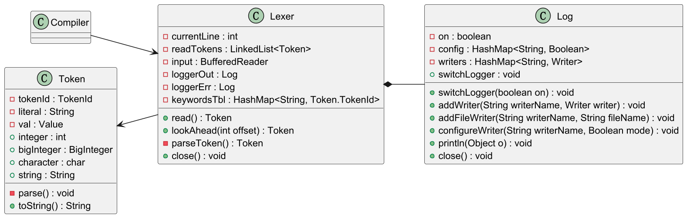

# Design Documentation

[TOC]

## 0. Reference compiler: tolangc

### 0.1 Arch

### 0.2 Interface

### 0.3 File arch

## 1. General design

### 1.1 Arch

### 1.2 Interface

### 1.3 File arch

## 2. Lexical analysis

### 2.1 Initial design

The lexical analysis section of the compiler provides several modules: I/O handler, and the lexer itself.

| Class          | Function          | Description                                                  |
| -------------- | ----------------- | ------------------------------------------------------------ |
| datastruct.ast.Token | Datatype of token | Restore all information of a token, including token type `tokenId`, literal string `literal` and attributes `val`. |
| frontend.Lexer | Lexical analyzer  | Use a `BufferedReader` of `System.in` for input, and provide `read()` for fetching the next token. Each contains two loggers `stdout` and `stderr` generating output info in `read()` process. |
| io.Log         | Log output        | This is a reusable logger class. Contains a table of writers to put the same info to various output. Provide `addWriter`, `addFilewriter` and `configureWriter` for writer configurations. |


### 2.2 Modified design

Further insight into the use of causes the following modification in design:

1. Cancel single instance design;

2. Seperate source of input, alter lexer input;

3. Add `lookAhead()` method and supporting mechanisms.

**The modification 1 & 2 intends to enable a lexer to be reused during any period of compiling, as long as it is provided with a `Reader` or an input `String`.** This will combine with a reusable parser together to form a mechanism to "recompile" some code fragments when needed, e.x. when lowering a subtree of an AST.

The modification 3 is mainly to support the look-ahead operation, which is used by the syntax analyser(parse).



#### 2.2.1 Look-ahead mechanisms

In the new architecture, *only call to method `parseToken()` will advance the lexer's cursor and return a new token.* This method is set to private for use inside the Lexer class; meanwhile, *`read()` and `lookAhead(offset)`* are presented to users as interfaces for getting next and advance the cursor, or looking offset without moving the cursor.

A new list `readTokens` stores the tokens already parsed out by `parseToken()`. Any request to a new token, either by `read()` or `lookAhead(offset)`, will first try to find if the required token is already in the list. If the token required is not in the list, `parseToken()` will be continuously called until the required token appears in the list. A difference between `read()` and `lookAhead()` is that read will remove the first token from `readTokens` while looking ahead won't.

#### 2.2.2 Extracting input source

The original input for Lexer is initialized within the Lexer class. However, a lexer should not only be able to be called once, and handle only the source program passed in at the very begenning; it should also be able to create several instances, each handling different piece of source input, even at the same time. So the new design provides 2 ways of setting the lexer's input: by passing in a `Reader` or by directly passing in a `String` to tokenize.

## 3. Syntax anaysis

### Step 1: Basic syntax

Logic of parsing basic syntax into an AST.

### Step 2: Lowering advanced syntax

Add parsing logic for advanced syntax; then add AST transformation logic to transform AST including higher level syntax into a basic AST.

## 4. Semantic analysis

### 4.1 Symbol datatypes

Datatypes for symbols are as follow:

```
Symbol
=> SymVar
=> SymFunc
```

Different symbol types are distinguished by `SymId` defined in class `Symbol`.

**To extract inner info of `Symbol`,** each symbol is created from a piece of code `AstNode piece`, implementing symbol parsing details. User can simply write: `symTbl.addSyms(Symbol.from(astNode))`!

### 4.2 Symbol table

Under instruction of the *KISS* principle, design choices are made for the symbol table as listed below:

- **An individual module**, interacting with other components instead of part of either of them.
- **Persistent rather than temporary symbol data storage** for its individuality. 
- **Using graph representation instead of a stack** mainly for persistency, but also for extensibility in language's semantics(means that the `SymTbl` class may be reused by compilers of other languages).

```
SymTbl {
    curScope = TreeRoot,
    curId = 1, // for pushing only
    Tree<(Scope, isVisited)> = [ (Scope, 0) ]
}

Scope {
	id = 1,
	visited = 0,
    upper,
    List<Scope> lowers,
    List<Symbol> = []
}
```

`SymTbl` provides several methods for editing and accessing symbol info, abstracting out the *scope* managing details:

| Methods       | Description                                                  |
| ------------- | ------------------------------------------------------------ |
| (Constructor) | The `SymTbl`'s constructor initialize an empty symbol table, with a single `Scope` already setup for the outer scope. |
| initVisits    | Prepare for visits: reset `isVisited` status for all scopes, and place `curScope` at the root scope. |
| searchSym     | Search for the  `Symbol` by specified symbol string, from the current scope up to the scope tree's root. |
| addSyms       | Add all `Symbol`s in the given collection.                   |
| pushScope     | Create a new sub-scope under the current scope with `curId + 1`. |
| enterScope    | Enter the next unvisited sub-scope of the current scope.     |
| exitScope     | Return to the upper scope of the current scope.              |

### 4.3 The AST validator

In semantic analysis phase, an AST provided by the parser is passed to an "validator", who will **validate semantics, reporting any error it encounters, and try performing certain error recovery operations on the AST.** A program with semantic errors may be compiled with recoveries or be refused by the compiler, based on design choices within the validator; however, a validator **ensures the "translator" in the later compiling stage always gets a valid AST, and only need to perform translation operations.**

## 5. Error handling

## 6. Code gen

## 7. Tests

### 7.1 Design principles

- Principle 0: Keep it simple.

- Principle 1: good if nothing printed. Only print when something goes wrong.

- Principle 2: testing by incrementing; that is, testing a part of the basic functionalities, and use those already tested for the next testcase.